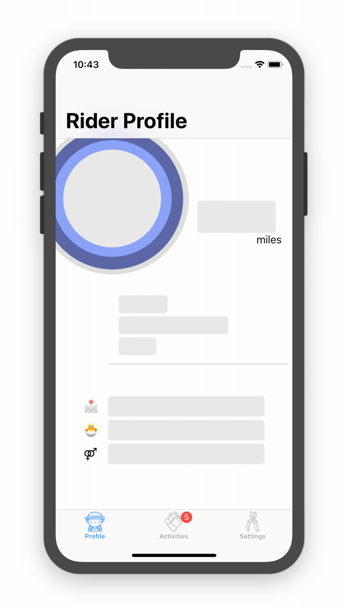
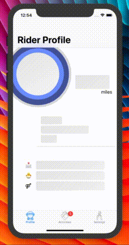
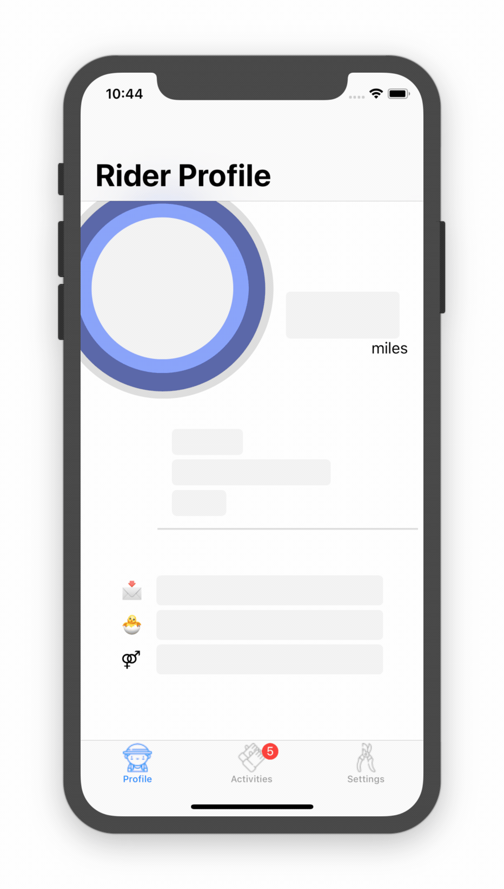
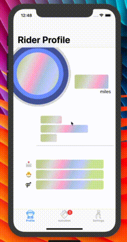

<p align="center">

</p>

[](https://travis-ci.org/robertherdzik/RHPlaceholder)
[](https://cocoapods.org/pods/RHPlaceholder)
[](/LICENSE)
[](https://developer.apple.com/iphone/index.action)
[](https://developer.apple.com/swift)
[](https://twitter.com/Roherdzik)

# RHPlaceholder 💾
Because traditional `loading view` like `UIActivityIndicatorView` or similar one are no longer so trendy (Facebook or Instagram apps are moving away from these approaches), I decided to create very simple library which will give you oportunity to have Facebook or Instagram 'view loading state' in your great project without big effort 💥! 🍕 

## Play with it 😎

## Installation
You can install library using <b> Cocoapods</b>:
```
pod 'RHPlaceholder'
```
or using 
<b> Carthage</b>:

add
```
github "robertherdzik/RHPlaceholder"
```
to your Cartfile and perform `carthage update --platform iOS.`

## Usage
WOW... it is soo easy to use 🙊! Base integration with your storyboard VC will take couple minutes 💥

### Base Usage
just create instance const of `Placeholder` in your `ViewController`:
```swift
private let placeholderMarker = Placeholder() // By default you will have Insta like gradient animation
```

bear in mind, that you can choose between couple of predefined animations (like e.g. RainbowAnimatorGradient):
```swift
private let placeholderMarker = Placeholder(layerAnimator: RainbowAnimatorGradient.self)
```

... and then just bind up library with your views which needs to be animated:

```swift
private func addPlaceholder() {
    let viewElements: [UIView] = [
        name,
        surname,
        age,
        email,
        birthDate
    ]
        
    placeholderMarker.register(viewElements)
}
```
call `addPlaceholder()` method in `viewDidLoad()`. 
Boom 😲 library has been associated with your views 👏

all what left, is to controll showing 'loading state' animation on your views using `startAnimation()` and `remove()`
```swift
func fetchUserData() {
    placeholderMarker.startAnimation()
    apiManager.fetchUser() { [weak self] user in 
        self?.placeholderMarker.remove()
        // .. rest of the method
    }
}
```

#### List of available animatotrs: 
##### (`default`) InstaLayerAnimatorGradient
<p align="center">

</p>

<table align="center" bgcolor="#FFFFFF">
  <tr>
    <th>BackAndForthLayerAnimatorGradient</th>
    <th>BackAndForthLayerAnimatorGradient</th>
    <th>BackAndForthLayerAnimatorGradient</th>
  </tr>
  <tr>
    <td></td>
    <td></td>
    <td></td>
  </tr>
</table>

#### Customization
You can add your own Animators, by conforming to the `LayerAnimating` protocol and passing your new Animator as a param to the `Placeholder` init.

## Swift support
| Library ver| Swift ver| Note |
| ------------- |:-------------:| ------------- |
| 0.0.3   | 4.1 | Very early version, API may change |
| 0.0.5   | 4.2 | Very early version, API may change |


## Check the Demo project

Please check out the demo project, you can see there how Library has been implemented in details.

### Layout Inspiration
Layout inspiration has been taken from one of the Dribbble projects, unfortunately I cannot find now this project anymore, because of that I cannot annotate creator in here 😦...

### Assets
---
- Great 😍 tab bar icons from:
<div>Icons made by <a href="http://www.freepik.com" title="Freepik">Freepik</a> from <a href="https://www.flaticon.com/" title="Flaticon">www.flaticon.com</a> is licensed by <a href="http://creativecommons.org/licenses/by/3.0/" title="Creative Commons BY 3.0" target="_blank">CC 3.0 BY</a></div>

---

- Cool 😎 profile icon from:
<div>Icons made by <a href="http://www.freepik.com" title="Freepik">Freepik</a> from <a href="https://www.flaticon.com/" title="Flaticon">www.flaticon.com</a> is licensed by <a href="http://creativecommons.org/licenses/by/3.0/" title="Creative Commons BY 3.0" target="_blank">CC 3.0 BY</a></div>
